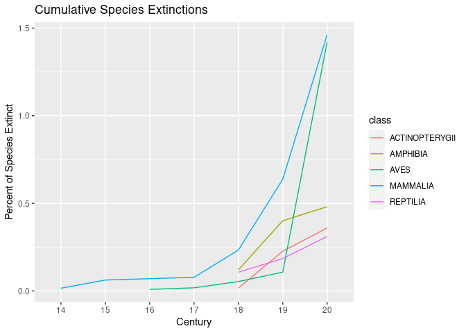

In order to examine extinction data, we need to download the IUCN Red
List historical data on species extinctions. This data can be found in
the following file, as our own attempt to call the URL caused the
database to crash. This file allows us to quickly access the data from
an external source (in this case a github page) rather than attempting
to access it from the API every time we ran our code.

    download.file("https://github.com/espm-157/extinction-template/releases/download/data2.0/extinction-data.zip", "extinction-data.zip")
    unzip("extinction-data.zip")

This chunk uses the REST API information from the IUCN website. This
code breaks the URL of the data into pieces that can be read by the
computer. This API call uses a universal base used by all of the
different calls. In this case, we only want to look at the total number
of species in the database, so our endpoint is “species count”. We are
using a public token (query) to access the data.

    base <- "https://apiv3.iucnredlist.org/api/v3"
    endpoint <- "speciescount"
    token <- "9bb4facb6d23f48efbf424bb05c0c1ef1cf6f468393bc745d42179ac4aca5fee"
    url<- (glue("{base}/{endpoint}?token={token}"))

    req <- GET(url)
    x <- content(req)
    x$speciescount

    [1] "150388"

    #https://apiv3.iucnredlist.org/api/v3/species/page/0?token=9bb4facb6d23f48efbf424bb05c0c1ef1cf6f468393bc745d42179ac4aca5fee

Retrieving all pages (0-15) with species data

    species_endpoint <- "species"
    page <- paste0("page/", 0:15)
    all_pages<- glue ("{base}/{species_endpoint}/{page}?token={token}")

Apply GET function to object all\_pages (functional programming).

    if(!file.exists("all_species.rds")){
    all_species<-map(all_pages, GET, .progress=TRUE)
    map(all_species, stop_for_status)
    write_rds(all_species, "all_species.rds")
    }

    all_species_rds<-read_rds("all_species.rds")

    #codes<-map_int(all_species, status_code)
    #stopifnot(all(codes<400))

Response objects from URLs.

    all_resp<- map(all_species_rds, content, encoding="UTF-8")

Calling the relevant information needed to describe extinct species.
Scientific name, category (ex: threatened, endangered, extinct) and
class.

    sci_name_list<-map(all_resp, \(page) map_chr(page$result, "scientific_name"))|> list_c()

    #x<-unlist(sci_name)

    category<- map(all_resp, \(page) map_chr(page$result, "category"))|> list_c()

    class<-map(all_resp, \(page) map_chr(page$result, "class_name"))|> list_c()

    all_species_table<- tibble(sci_name=sci_name_list, category, class)

    if(!file.exists("ex_narrative.rds")){
      ex_narrative<- map(ex_urls, GET)
      map(ex_narrative, stop_for_status, .progress=TRUE)
      write_rds(ex_narrative, "ex_narrative.rds")
    }

    ex_narrative<-read_rds("ex_narrative.rds")

    narrative_contents<- map(ex_narrative, content)

    narrative_population<-map(narrative_contents, \(content)     map_chr(content$result[1], "population", .default=""))

    head(narrative_population, 20)

    [[1]]
    [1] "This species is now extinct; it was last recorded in 1975."

    [[2]]
    [1] ""

    [[3]]
    [1] ""

    [[4]]
    [1] ""

    [[5]]
    [1] ""

    [[6]]
    [1] ""

    [[7]]
    [1] ""

    [[8]]
    [1] ""

    [[9]]
    [1] ""

    [[10]]
    [1] ""

    [[11]]
    [1] ""

    [[12]]
    [1] ""

    [[13]]
    [1] ""

    [[14]]
    [1] ""

    [[15]]
    [1] ""

    [[16]]
    [1] ""

    [[17]]
    [1] ""

    [[18]]
    [1] ""

    [[19]]
    [1] ""

    [[20]]
    [1] "This species seems to have mostly vanished from all its native range and mainly survives in its introduced range in Kazakhstan and China. Now there seems to be only extremely rare natural reproduction within its native range, but single individuals are still present while the species is still stocked in Iran, Kazakhstan and Russia. It cannot be fully excluded that limited reproduction still takes place.  In the Black Sea, the Ship Sturgeon ascended the Rioni River (Georgia), where the last adult individual was recorded in 1997 as a bycatch (Zarkua pers. comm.). In 2020, six juveniles were caught in the Rioni River. Genetic analyses demonstrated that these individuals did not originate from captive broodstocks (Mugue pers. comm). The last individuals of the species in the Danube River were recorded in 2003 in Serbia at Apatin (released alive) and in 2005 in Mura in Hungary (killed); both fish were males (Simonovic <em>et al</em>. 2003, Streibel pers. comm.). In Romania, according to fishermen surveys carried out between 1996 and 2001, 15 individuals were caught by Romanian fishermen (the last scientifically recorded specimen was in the 1950s) (Suciu <em>et al</em>. 2009). In the Hungarian Danube, one specimen was caught in 2009 (died in a hatchery).  The species has not been caught in Ukraine for the past 30 years.  In Kazakhstan, 12 tonnes were caught in 1990, 26 tonnes in 1999; in Iran 1.9 tonnes were caught in 1990, 21 tonnes in 1999 (CITES Doc. AC.16.7.2), and 1 ton in 2005/6. In total, 0.5–1% of the sturgeon catch in Iran belonged to this species in the past 20 years (M. Pourkazemi pers. comm.)."

    narrative_rationale<-map(narrative_contents, \(content) content$result[[1]]$rationale)

    extinct_species<- 
      all_species_table|> 
      dplyr::filter(category=="EX")
    head(extinct_species)

    # A tibble: 6 × 3
      sci_name                   category class         
      <chr>                      <chr>    <chr>         
    1 Mirogrex hulensis          EX       ACTINOPTERYGII
    2 Acanthametropus pecatonica EX       INSECTA       
    3 Achatinella abbreviata     EX       GASTROPODA    
    4 Achatinella buddii         EX       GASTROPODA    
    5 Achatinella caesia         EX       GASTROPODA    
    6 Achatinella casta          EX       GASTROPODA    

    sci_name<- extinct_species$sci_name
    ex_urls<- glue("{base}/species/narrative/{sci_name}?token={token}")|>
      URLencode()
    ex_urls[[1]]

    [1] "https://apiv3.iucnredlist.org/api/v3/species/narrative/Mirogrex%20hulensis?token=9bb4facb6d23f48efbf424bb05c0c1ef1cf6f468393bc745d42179ac4aca5fee"

    GET(ex_urls[[1]])

    Response [https://apiv3.iucnredlist.org/api/v3/species/narrative/Mirogrex%20hulensis?token=9bb4facb6d23f48efbf424bb05c0c1ef1cf6f468393bc745d42179ac4aca5fee]
      Date: 2023-11-28 21:14
      Status: 200
      Content-Type: application/json; charset=utf-8
      Size: 1.65 kB

    #dates<-narrative_rationale[1:20] |> map(str_extract, "\\d{4}")

    last_seen<-narrative_population |> 
      map_chr(str_extract, "\\d{4}")|> 
      as.integer()
      
    #last_century<-narrative_population |> 
    #  map_chr(str_extract, "\\d{2}th")|> 
     # as.character()

    gone<-tibble(sci_name, last_seen)|>
      distinct()
    head(gone)

    # A tibble: 6 × 2
      sci_name                   last_seen
      <chr>                          <int>
    1 Mirogrex hulensis               1975
    2 Acanthametropus pecatonica        NA
    3 Achatinella abbreviata            NA
    4 Achatinella buddii                NA
    5 Achatinella caesia                NA
    6 Achatinella casta                 NA

Joining these lists together and making all\_species lists into a tibble

    #x|> count(category)

    combined<-dplyr::left_join(all_species_table, gone)

    Joining with `by = join_by(sci_name)`

    total_sp<-combined|>
      filter(class%in% c("MAMMALIA", "AVES", "AMPHIBIA", "REPTILIA", "ACTINOPTERYGII"))|>
      count(class, name="total")

    #filtered by extinctions by class and counts number of extinctions per century
    cumulative<-combined|>
      filter(category=="EX")|>
      filter(class%in% c("MAMMALIA", "AVES", "AMPHIBIA", "REPTILIA", "ACTINOPTERYGII"))|>
      mutate(last_seen= replace_na(last_seen, 2023), century= str_extract(last_seen, "\\d{2}"))|>
      count(century, class)|>
      left_join(total_sp)|>
      group_by(class)|>
      mutate(percent_extinct=((n/total)*100))|>
      mutate(cumulative_extinct=(cumsum(n))) |>
      mutate(percent_cumulative_extinct=((cumulative_extinct/total)*100)) 

    Joining with `by = join_by(class)`

    cumulative

    # A tibble: 20 × 7
    # Groups:   class [5]
       century class              n total percent_extinct cumulative_extinct
       <chr>   <chr>          <int> <int>           <dbl>              <int>
     1 14      MAMMALIA           1  6427         0.0156                   1
     2 15      MAMMALIA           3  6427         0.0467                   4
     3 16      AVES               1 11188         0.00894                  1
     4 17      AVES               1 11188         0.00894                  2
     5 17      MAMMALIA           1  6427         0.0156                   5
     6 18      ACTINOPTERYGII     4 24223         0.0165                   4
     7 18      AMPHIBIA           9  7487         0.120                    9
     8 18      AVES               4 11188         0.0358                   6
     9 18      MAMMALIA          10  6427         0.156                   15
    10 18      REPTILIA          11 10283         0.107                   11
    11 19      ACTINOPTERYGII    51 24223         0.211                   55
    12 19      AMPHIBIA          21  7487         0.280                   30
    13 19      AVES               6 11188         0.0536                  12
    14 19      MAMMALIA          26  6427         0.405                   41
    15 19      REPTILIA           8 10283         0.0778                  19
    16 20      ACTINOPTERYGII    32 24223         0.132                   87
    17 20      AMPHIBIA           6  7487         0.0801                  36
    18 20      AVES             147 11188         1.31                   159
    19 20      MAMMALIA          53  6427         0.825                   94
    20 20      REPTILIA          13 10283         0.126                   32
    # ℹ 1 more variable: percent_cumulative_extinct <dbl>

    extinctions_plot<- cumulative|>
      ggplot()+
      geom_line(aes(x=century, y=percent_cumulative_extinct, color=class, group=class))+
      ggtitle("Cumulative Species Extinctions")+
      xlab("Century")+
      ylab("Percent of Species Extinct")
    extinctions_plot

Discuss issues with the data set (ie dates that are not explicitly
written out 17th century etc. that would be dropped from the dataset,
replacing NA values with 2023). Discuss differences in how much data is
collected for each class. Implications of the graph. Discuss issues with
sampling methods.

    #Tester tables to look at extinction dates for different classes  
    birds<-combined|>
      filter(class=="AVES", category=="EX")|>
      mutate(last_seen= replace_na(last_seen, 2023))
    unique(birds$last_seen)

     [1] 2023 1960 2011 1907 2004 1700 1870 1850 1900 1600 2018 1969 1981 1990 1860
    [16] 1891

    amphibians<- combined|>
      filter(class=="AMPHIBIA", category=="EX")|>
      mutate(last_seen= tidyr::replace_na(last_seen, 2023))
    head(amphibians, 20)

    # A tibble: 20 × 4
       sci_name                  category class    last_seen
       <chr>                     <chr>    <chr>        <int>
     1 Incilius periglenes       EX       AMPHIBIA      1989
     2 Litoria nyakalensis       EX       AMPHIBIA      1990
     3 Phrynomedusa fimbriata    EX       AMPHIBIA      2023
     4 Lithobates fisheri        EX       AMPHIBIA      1942
     5 Rheobatrachus silus       EX       AMPHIBIA      1990
     6 Rheobatrachus vitellinus  EX       AMPHIBIA      1985
     7 Taudactylus acutirostris  EX       AMPHIBIA      1988
     8 Taudactylus diurnus       EX       AMPHIBIA      1970
     9 Plethodon ainsworthi      EX       AMPHIBIA      1964
    10 Atelopus chiriquiensis    EX       AMPHIBIA      1997
    11 Atelopus senex            EX       AMPHIBIA      1985
    12 Atelopus vogli            EX       AMPHIBIA      2004
    13 Oophaga speciosa          EX       AMPHIBIA      1992
    14 Craugastor anciano        EX       AMPHIBIA      1995
    15 Craugastor myllomyllon    EX       AMPHIBIA      1978
    16 Craugastor omoaensis      EX       AMPHIBIA      1974
    17 Nannophrys guentheri      EX       AMPHIBIA      2020
    18 Pseudophilautus adspersus EX       AMPHIBIA      1886
    19 Pseudophilautus dimbullae EX       AMPHIBIA      2020
    20 Pseudophilautus eximius   EX       AMPHIBIA      1933

    #final table should include extinctions by year, cumulative extinctions up to and including each year, and percentage of total species that are extinct by year

## Extinctions Module

*Are we experiencing the sixth great extinction?*

What is the current pace of extinction? Is it accelerating? How does it
compare to background extinction rates?

Background extinctions rate is one species per million years.

## Background

-   [Section Intro Video](https://youtu.be/QsH6ytm89GI)
-   [Ceballos et al (2015)](http://doi.org/10.1126/sciadv.1400253)

Our focal task will be to reproduce the result from Ceballos and
colleagues showing the recent increase in extinction rates relative to
the background rate:

## Computational Topics

-   Accessing data from a RESTful API
-   Error handling
-   JSON data format
-   Regular expressions
-   Working with missing values

## Additional references:

-   <http://www.hhmi.org/biointeractive/biodiversity-age-humans> (Video)
-   [Barnosky et al. (2011)](http://doi.org/10.1038/nature09678)
-   [Pimm et al (2014)](http://doi.org/10.1126/science.1246752)
-   [Sandom et al (2014)](http://dx.doi.org/10.1098/rspb.2013.3254)
